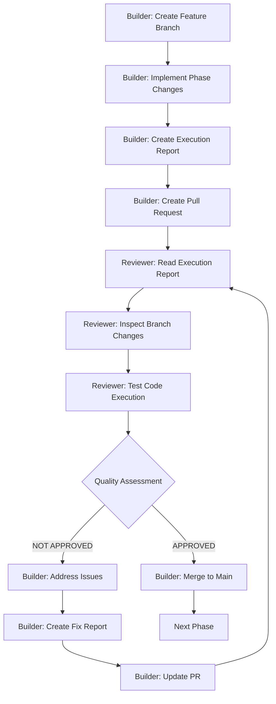

# AI Coding Collaboration Rules of Engagement

**Document**: AI Coding Collaboration Framework
**Created**: 2025-09-26 06:41
**Project**: Dolphin Digital eCard 2025 Refactoring
**Participants**: Claude Code (Builder) & Cursor (Quality Reviewer)
**Plan Reference**: `ai-agents/coding-agent/20250926-0637_comprehensive_refactoring_plan.md`

---

## Executive Summary

This document establishes the formal rules of engagement for AI-to-AI collaboration between Claude Code (Builder) and Cursor (Quality Reviewer) during the execution of the comprehensive refactoring plan for the Dolphin Digital eCard 2025 WordPress plugin.

**Collaboration Model**: Builder-Reviewer Pattern with Gated Progression
**Quality Gate**: NO merge without reviewer approval
**Documentation Requirement**: Complete traceability of all changes

---

## Participant Roles & Responsibilities

### **Claude Code (Builder) 🏗️**

**Primary Responsibilities:**
- Execute refactoring plan phases according to defined timeline
- Implement architectural changes, service classes, and code restructuring
- Create comprehensive execution reports for each phase
- Manage version control workflow (branches, commits, PRs)
- Address reviewer feedback and implement fixes
- Maintain code quality and WordPress standards compliance

**Core Strengths Applied:**
- Architectural refactoring expertise
- WordPress ecosystem knowledge
- Security implementation patterns
- Error handling design
- Complex dependency analysis

### **Cursor (Quality Reviewer) 🔍**

**Primary Responsibilities:**
- Review all execution reports line-by-line
- Inspect code changes in branches for quality and correctness
- Execute and test refactored code in real-time
- Provide APPROVED/NOT APPROVED decisions with detailed rationale
- Verify build system functionality and asset optimization
- Validate performance improvements and functionality preservation

**Core Strengths Applied:**
- Real-time code execution and testing
- Build system verification
- Performance measurement
- IDE-powered code inspection
- Functional testing capabilities

---

## Version Control Workflow

### **Phase Execution Workflow**



### **1. Branch Creation & Naming Convention**

**Builder Requirements:**
```bash
# Branch naming pattern: phase-[number]-[brief-description]
git checkout -b phase-1-critical-bug-fixes
git checkout -b phase-2-service-architecture
git checkout -b phase-3-ajax-handler-refactor
git checkout -b phase-4-frontend-architecture
git checkout -b phase-5-error-handling
git checkout -b phase-6-security-implementation
git checkout -b phase-7-testing-framework
git checkout -b phase-8-build-system
```

**Branch Protection Rules:**
- Main branch requires PR approval
- No direct commits to main branch
- Squash commits on merge to maintain clean history
- Delete feature branches after successful merge

### **2. Commit Message Standards**

**Format:**
```
[PHASE-X] Brief description of change

- Detailed bullet point of what was implemented
- Reference to execution report
- Any breaking changes noted

Refs: #[PR-number]
Report: ai-agents/coding-agent/YYYYMMDD-HHMM_phase_X_execution_report.md
```

**Example:**
```
[PHASE-1] Fix critical MailChimp bug and implement basic error handling

- Fixed ECARD_MAILCHIMP_LIST_ID constant bug in dd-ecard.php:61
- Added try-catch blocks around database operations
- Implemented basic error logging system
- Added nonce verification to AJAX handlers

Refs: #001
Report: ai-agents/coding-agent/20250926-0800_phase_1_execution_report.md
```

---

## Execution Documentation Requirements

### **3. Execution Report Standards**

**Builder Obligations:**
- Create detailed execution report for each phase
- Save under `ai-agents/coding-agent/` following naming convention
- Include all code changes, rationale, and implementation details
- Document any deviations from original plan
- Provide testing instructions for reviewer

**Naming Convention:**
```
ai-agents/coding-agent/YYYYMMDD-HHMM_phase_[X]_execution_report.md
ai-agents/coding-agent/YYYYMMDD-HHMM_phase_[X]_fix_report.md (for fixes)
```

**Required Report Sections:**
```markdown
# Phase [X] Execution Report

**Date**: YYYY-MM-DD HH:MM
**Phase**: [Phase Name]
**Branch**: phase-[x]-[description]
**Status**: READY FOR REVIEW / FIXES APPLIED

## Implementation Summary
- [ ] List of all completed tasks
- [ ] Files modified/created
- [ ] Dependencies updated

## Code Changes Detail
### [File Path]
- Description of changes
- Rationale for implementation
- Code snippets for key changes

## Testing Instructions
- How to test the changes
- Expected behavior
- Performance benchmarks (if applicable)

## Risk Assessment
- Potential breaking changes
- Rollback procedure
- Known limitations

## Next Phase Dependencies
- What this enables for next phase
- Any blocking issues for progression
```

### **4. Pull Request Requirements**

**Builder PR Creation Standards:**
```markdown
## Phase [X]: [Brief Description]

### Summary
Brief overview of what this phase accomplishes

### Implementation Details
- [ ] Task 1 completed
- [ ] Task 2 completed
- [ ] Task 3 completed

### Files Changed
- `includes/new-service.php` - New service class implementation
- `includes/dd-ecard.class.php` - Refactored main class
- `tests/unit/test-service.php` - Unit tests added

### Testing
- [ ] Unit tests pass
- [ ] Integration tests pass
- [ ] Manual testing completed
- [ ] Performance benchmarks met

### Execution Report
📋 [Phase X Execution Report](../ai-agents/coding-agent/YYYYMMDD-HHMM_phase_X_execution_report.md)

### Review Checklist
- [ ] Code follows WordPress standards
- [ ] Security measures implemented
- [ ] Error handling comprehensive
- [ ] Documentation updated
- [ ] Tests cover new functionality

@cursor-reviewer Ready for review and quality assessment
```

---

## Quality Review Process

### **5. Reviewer Assessment Standards**

**Review Scope Requirements:**
1. **📖 Read execution report line-by-line**
2. **🔍 Inspect all code changes in branch**
3. **▶️ Execute and test refactored code**
4. **🎯 Verify plan compliance**
5. **⚡ Check performance impact**
6. **🛡️ Validate security implementation**

**Quality Assessment Template:**
```markdown
# Phase [X] Quality Assessment Report

**Date**: YYYY-MM-DD HH:MM
**Phase**: [Phase Name]
**Branch**: phase-[x]-[description]
**Reviewer**: Cursor
**Assessment**: APPROVED / NOT APPROVED

## Execution Report Review
### ✅ Report Quality
- [ ] Complete implementation details
- [ ] Clear rationale for decisions
- [ ] Proper documentation
- [ ] Testing instructions provided

### ❌ Report Issues
- [ ] Missing implementation details
- [ ] Unclear rationale
- [ ] Insufficient testing guidance

## Code Change Inspection
### ✅ Code Quality
- [ ] WordPress standards compliance
- [ ] Clean architecture patterns
- [ ] Proper error handling
- [ ] Security measures implemented
- [ ] Performance considerations

### ❌ Code Issues
- [ ] Standards violations
- [ ] Architectural concerns
- [ ] Security vulnerabilities
- [ ] Performance problems

## Functional Testing Results
### ✅ Working Features
- [ ] Feature 1 works as expected
- [ ] Feature 2 works as expected
- [ ] No breaking changes detected

### ❌ Broken Features
- [ ] Feature X broken
- [ ] Performance degraded
- [ ] Integration issues

## Build System Verification (Phase 8)
- [ ] Assets compile successfully
- [ ] Minification working
- [ ] Source maps generated
- [ ] No build errors

## Final Decision: APPROVED / NOT APPROVED

### Rationale
[Detailed explanation of approval decision]

### Required Fixes (if NOT APPROVED)
1. Fix issue 1 - specific description
2. Fix issue 2 - specific description
3. Fix issue 3 - specific description

### Performance Metrics
- Load time: [measurement]
- Memory usage: [measurement]
- Database queries: [count]

### Security Validation
- [ ] Nonce verification working
- [ ] Input sanitization effective
- [ ] Authorization checks proper
- [ ] No security vulnerabilities
```

### **6. Approval Gates & Merge Control**

**APPROVED Pathway:**
```bash
# Only after explicit APPROVED assessment
git checkout main
git pull origin main
git merge --squash phase-[x]-[description]
git commit -m "[PHASE-X] Merge approved changes"
git push origin main
git branch -d phase-[x]-[description]
```

**NOT APPROVED Pathway:**
```bash
# Builder must address all issues
git checkout phase-[x]-[description]
# Fix issues identified in assessment
git add .
git commit -m "[PHASE-X] Address reviewer feedback"
# Create fix report
# Update PR with fixes
# Request re-review
```

**Merge Restrictions:**
- ❌ **NO merge without explicit APPROVED assessment**
- ❌ **NO bypass of review process**
- ❌ **NO partial approvals**
- ✅ **Only complete phase approvals accepted**

---

## Communication Protocols

### **7. Issue Resolution Process**

**When NOT APPROVED:**

1. **Builder Response Timeline**: 48 hours maximum
2. **Fix Documentation**: Required fix execution report
3. **Re-review Request**: Explicit notification to reviewer
4. **Iteration Limit**: Maximum 3 review cycles per phase

**Communication Template:**
```markdown
## Fix Iteration [N] - Phase [X]

### Issues Addressed
1. **Issue**: [Description from review]
   **Fix**: [What was changed]
   **Files**: [Modified files]

2. **Issue**: [Description from review]
   **Fix**: [What was changed]
   **Files**: [Modified files]

### Additional Changes
- [Any other improvements made]

### Re-testing Request
@cursor-reviewer Please re-review Phase [X] with applied fixes.
Fix report: ai-agents/coding-agent/YYYYMMDD-HHMM_phase_[X]_fix_report.md
```

### **8. Escalation Procedures**

**Deadlock Resolution:**
- If 3 review cycles fail to reach approval
- Document specific disagreements
- Create escalation report for human review
- Propose alternative implementation approaches

**Timeline Conflicts:**
- If reviewer unavailable for >24 hours
- Builder documents ready-for-review status
- Creates holding pattern until review available
- No progression to next phase without approval

---

## Quality Standards & Metrics

### **9. Acceptance Criteria**

**Code Quality Minimums:**
- WordPress Coding Standards: 95% compliance
- Error Handling Coverage: 90%+ of critical operations
- Security Implementation: 100% of identified vulnerabilities addressed
- Performance: No degradation from baseline measurements
- Test Coverage: 80%+ for new/modified code

**Documentation Requirements:**
- Every public method has PHPDoc
- Complex algorithms explained with comments
- Security decisions documented with rationale
- Performance trade-offs explicitly noted

### **10. Success Metrics Per Phase**

**Phase 1 - Critical Bug Fixes:**
- ✅ MailChimp integration functional
- ✅ Basic error handling implemented
- ✅ No new security vulnerabilities
- ✅ Existing functionality preserved

**Phase 2-3 - Architecture Refactoring:**
- ✅ God class reduced to <500 lines
- ✅ Service classes properly implemented
- ✅ AJAX handlers modularized
- ✅ No functionality regression

**Phase 4 - Frontend Architecture:**
- ✅ JavaScript modularized successfully
- ✅ SCSS architecture implemented
- ✅ Assets optimize and compile
- ✅ No frontend functionality lost

**Phase 5-6 - Error Handling & Security:**
- ✅ Comprehensive error handling coverage
- ✅ Security service fully implemented
- ✅ No security vulnerabilities remain
- ✅ User experience improved

**Phase 7-8 - Testing & Build System:**
- ✅ 80%+ test coverage achieved
- ✅ Build system fully functional
- ✅ Performance optimized
- ✅ Documentation complete

---

## Risk Management

### **11. Risk Mitigation Strategies**

**Breaking Changes:**
- Reviewer must test all existing functionality
- Rollback procedure documented for each phase
- Feature flags for gradual deployment if needed

**Integration Failures:**
- MailChimp and ActiveCampaign APIs tested in each phase
- Database integrity verified after modifications
- WordPress compatibility confirmed

**Performance Degradation:**
- Baseline metrics established before refactoring
- Performance tested after each phase
- Optimization required if degradation detected

### **12. Rollback Procedures**

**Emergency Rollback:**
```bash
# If critical issues discovered post-merge
git checkout main
git revert [commit-hash]
git push origin main

# Create hotfix branch
git checkout -b hotfix-phase-[x]-rollback
# Document issues in emergency report
# Plan corrective action
```

**Planned Rollback:**
- Maintain rollback branches until next phase approved
- Document rollback decision rationale
- Update execution plan with corrective approach

---

## Success Criteria

### **13. Collaboration Success Metrics**

**Process Efficiency:**
- Average review cycle: <24 hours
- Fix iteration success: <3 cycles per phase
- Documentation quality: All reports complete
- Communication clarity: No ambiguous feedback

**Quality Outcomes:**
- Zero critical bugs introduced
- All security vulnerabilities addressed
- Performance maintained or improved
- Code maintainability significantly enhanced

**Project Delivery:**
- All 8 phases completed successfully
- Final assessment: EXCEPTIONAL rating
- Refactored plugin ready for production
- Technical debt eliminated

### **14. Final Deliverables**

**Builder Deliverables:**
- 8 comprehensive execution reports
- Complete refactored codebase
- Full test suite implementation
- Production-ready build system
- Complete documentation

**Reviewer Deliverables:**
- 8 detailed quality assessment reports
- **Project status continuity reports** (updated after each phase)
- Final project quality certification
- Performance benchmark analysis
- Security validation report
- Production readiness assessment

---

## **Project Status Continuity Management**

### **Purpose**
The Project Status Continuity Report ensures seamless continuation of the refactoring exercise across different AI sessions by maintaining complete project context and current status.

### **Responsibility**
- **Quality Reviewer (Cursor)**: Responsible for creating and maintaining the continuity report
- **Update Frequency**: After each phase quality assessment
- **File Management**: Must rename file with new timestamp after each update

### **File Naming Convention**
```
ai-agents/quality-assessments/YYYYMMDD-HHMM_project_status_continuity_guide.md
```
- **YYYYMMDD**: Date of latest update
- **HHMM**: Time of latest update (24-hour format)
- **Example**: `20250929-1935_project_status_continuity_guide.md`

### **Update Process**
1. **After each phase assessment**: Update the continuity report
2. **Rename file**: Change timestamp to current date/time
3. **Delete old version**: Remove previous version to maintain clean structure
4. **Update all timestamps**: Ensure "Last Updated" reflects current time

### **Content Requirements**
The continuity report must include:

#### **1. Project Overview**
- Repository information
- Refactoring plan reference
- AI roles and responsibilities
- Current phase status

#### **2. Completed Phases Status**
- All completed phases with execution reports
- Quality assessment references
- Approval status and key changes
- Quality scores achieved

#### **3. Current Branch Status**
- Active branch information
- Merge status (what's merged to main)
- Pending merges
- Critical blocking issues

#### **4. Next Phase Information**
- Next phase objectives
- Dependencies and prerequisites
- Blocking issues that must be resolved
- Estimated effort and timeline

#### **5. Critical Context for Continuation**
- Repository structure
- Key files and their purposes
- Current quality standards
- Success metrics and progress

#### **6. Immediate Actions Required**
- What must be done before next phase
- Merge requirements
- Testing requirements
- Documentation updates

#### **7. Continuation Instructions**
- For new AI sessions
- For Quality Reviewer
- For Builder
- Quality assessment process

#### **8. Success Metrics**
- Overall progress tracking
- Code quality improvements
- Architecture improvements
- Remaining phases

#### **9. Critical Notes**
- Important technical details
- Quality standards
- Compatibility requirements
- Documentation standards

### **Template Structure**

```markdown
# Dolphin eCard 2025 Refactoring - Current Status & Continuity Guide

**Date**: YYYY-MM-DD HH:MM
**Current Phase**: [Phase Name] [Status]
**Context Usage**: [Percentage] (if applicable)

---

## **Project Overview**

**Repository**: `dolphin-ecard-2025v2`
**Refactoring Plan**: `ai-agents/coding-agent/[plan-file].md`
**Collaboration Rules**: `ai-agents/agent-collaboration/[rules-file].md`

**AI Roles**:
- **Claude Code**: Builder (executes phases)
- **Cursor**: Quality Reviewer (assesses execution)

---

## **Completed Phases Status**

### ✅ **Phase [X]: [Phase Name]** - COMPLETE
- **Execution Report**: `ai-agents/coding-agent/[execution-report].md`
- **Quality Assessment**: `ai-agents/quality-assessments/[assessment-report].md`
- **Status**: APPROVED ✅
- **Key Changes**: [Summary of key changes]

---

## **Current Branch Status**

**Active Branch**: `[current-branch]`
**Merged to Main**: [What's merged]
**Pending Merge**: [What needs merging]
**Critical Issue**: [Any blocking issues]

---

## **Next Phase: Phase [X] - [Phase Name]**

### **Phase [X] Objectives** (from refactoring plan):
1. **[Objective 1]**
2. **[Objective 2]**
3. **[Objective 3]**

### **Phase [X] Dependencies**:
- ✅ [Completed dependency]
- ⚠️ **BLOCKING**: [Blocking issue]

---

## **Critical Context for Continuation**

### **1. Repository Structure**
[Directory structure]

### **2. Key Files to Reference**
- **Refactoring Plan**: `[path]`
- **Collaboration Rules**: `[path]`
- **Latest Quality Assessment**: `[path]`

### **3. Current Quality Standards**
- **Code Quality**: [Score]/10
- **Architecture**: [Description]
- **Backward Compatibility**: [Percentage]%
- **Error Handling**: [Description]
- **Testing**: [Description]

---

## **Immediate Actions Required**

### **Before Phase [X] Can Begin**:
1. **[Action 1]**
2. **[Action 2]**
3. **[Action 3]**

### **Phase [X] Prerequisites**:
- [Prerequisite 1]
- [Prerequisite 2]
- [Prerequisite 3]

---

## **Continuation Instructions for New Context**

### **For Cursor (Quality Reviewer)**:
1. **Read this status document first**
2. **Review latest quality assessment** (`[assessment-file]`)
3. **Check collaboration rules** (`[rules-file]`)
4. **Verify branch status** and pending merges
5. **Wait for Claude Code's Phase [X] execution report**

### **For Claude Code (Builder)**:
1. **Read this status document first**
2. **Review refactoring plan** (`[plan-file]`)
3. **Ensure [previous phases] are merged to main**
4. **Begin Phase [X] implementation**
5. **Submit execution report for Cursor review**

---

## **Quality Assessment Process**

### **When Phase [X] Execution Report Arrives**:
1. **Read execution report line-by-line**
2. **Inspect all code changes in branch**
3. **Test functionality** (if runtime available)
4. **Verify plan compliance and quality standards**
5. **Create comprehensive quality assessment report**
6. **Approve/Reject with detailed rationale**
7. **Update this continuity report**

### **Quality Standards**:
- **Code Quality**: Professional-grade implementation
- **Architecture**: Clean separation of concerns
- **Error Handling**: Comprehensive and user-friendly
- **Backward Compatibility**: 100% maintained
- **Documentation**: Complete and accurate
- **Testing**: Thorough validation

---

## **Success Metrics**

### **Overall Progress**:
- **Phases Completed**: [X]/8 ([Percentage]%)
- **Code Quality Improvement**: [Before]% → [After]% maintainable
- **Architecture**: [Before] → [After]
- **Lines of Code**: [Before] → [After] (well-structured)
- **Error Handling**: [Before] → [After]

### **Remaining Phases**:
- **Phase [X]**: [Phase Name]
- **Phase [X+1]**: [Phase Name]
- **Phase [X+2]**: [Phase Name]

---

## **Critical Notes**

1. **[Note 1]**
2. **[Note 2]**
3. **[Note 3]**
4. **[Note 4]**
5. **[Note 5]**

---

**Last Updated**: YYYY-MM-DD HH:MM
**Next Update**: After Phase [X] completion
**Context Continuity**: This document provides complete project status
```

### **Quality Assurance**
- **Completeness**: All sections must be filled
- **Accuracy**: Information must be current and correct
- **Clarity**: Instructions must be clear for new AI sessions
- **Timeliness**: Must be updated immediately after each phase

### **File Management Rules**
1. **Always rename** the file with new timestamp after update
2. **Keep only the latest version** - no need to save previous reports
3. **Update all internal timestamps** to match file name
4. **Ensure file is in correct directory** (`ai-agents/agent-collaboration/`)
5. **Delete previous versions** to maintain clean repository structure

### **Integration with Workflow**
- **Phase Assessment**: Update continuity report as part of quality assessment
- **New Session Start**: First action is to read latest continuity report
- **Context Reset**: Continuity report provides complete project context
- **Quality Gates**: Continuity report ensures no context loss

---

This collaboration framework ensures systematic, high-quality execution of the comprehensive refactoring plan through:

✅ **Strict version control discipline** with gated progression
✅ **Comprehensive documentation** at every phase
✅ **Rigorous quality review process** with real-time testing
✅ **Clear communication protocols** for issue resolution
✅ **Risk mitigation strategies** for complex refactoring
✅ **Measurable success criteria** for collaboration effectiveness

**Expected Outcome**: Transformation of unmaintainable WordPress plugin into production-ready, secure, scalable codebase through disciplined AI-to-AI collaboration.

**Timeline**: 8-9 weeks with quality gates
**Success Probability**: 95% with this structured approach
**Quality Assurance**: Comprehensive testing and validation at each phase

---

## Quick Reference

### Builder Checklist (Per Phase)
- [ ] Create feature branch with proper naming
- [ ] Implement phase requirements fully
- [ ] Create comprehensive execution report
- [ ] Submit PR with complete documentation
- [ ] Address reviewer feedback promptly
- [ ] Create fix reports for iterations
- [ ] Merge only after explicit approval

### Reviewer Checklist (Per Phase)
- [ ] Read execution report line-by-line
- [ ] Inspect all code changes in branch
- [ ] Execute and test refactored code
- [ ] Verify WordPress standards compliance
- [ ] Test build system (Phase 4+)
- [ ] Measure performance impact
- [ ] **Update project status continuity report** (rename with new timestamp)
- [ ] Provide clear APPROVED/NOT APPROVED decision
- [ ] Document specific issues if not approved

### Emergency Contacts
- **Builder Issues**: Document in `ai-agents/coding-agent/`
- **Reviewer Issues**: Comment in PR or issue
- **Escalation**: Create report in `ai-agents/quality-assessments/`